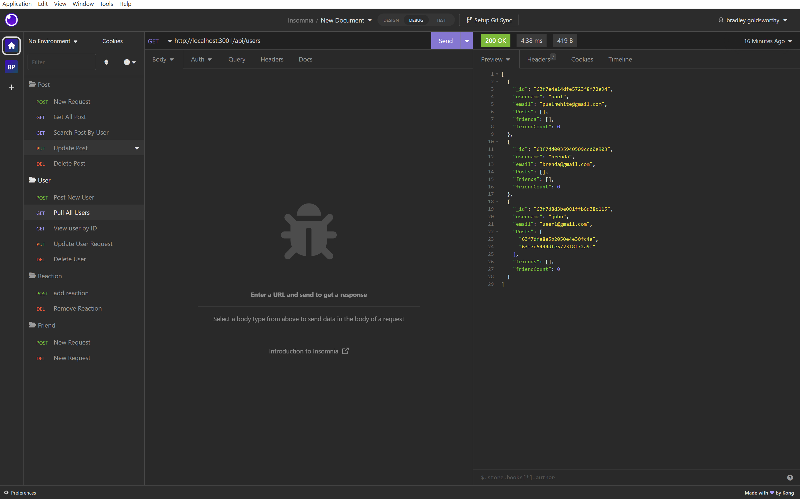

# Social-Network-API
NoSQL Challenge: Social Network API

# NoSQL: Social Network API

## Table of Contents

- [Description](#description)
- [Technology](#Technology)
- [Installation](#installation)
- [Usage](#usage)
- [License](#license)
- [Contribution](#contribution)
- [Questions](#questions)

## Description:

It's an API for a social network web application where users can share their thoughts, react to friends’ thoughts, and create a friend list.

## Technology:

Project is created with:

- Javascript
- Node.js
- Express.js
- MongoDB
- Mongoose

## Installation

To run this project, install it locally using npm:

```
npm install
```

## Usage

After installing npm packages, the application will be invoked by using the following command:

```
npm start
```

#### Walkthrough Video

[Click me to see the demo video!](https://www.youtube.com/watch?v=eVZr_DX4TJk)

#### Insomnia Screenshot



## License

[](https://opensource.org/licenses/MIT) <br>
This project is licensed under MIT, for more information please visit [this website](https://opensource.org/licenses/MIT)

## Contribution

Made by Bradley Goldsworthy

## Questions?

Please feel free to contact me if you need any further information:

- [Email](mailto:bg@bulkacity.com)
- [Github Profile](https://github.com/bulkacity)